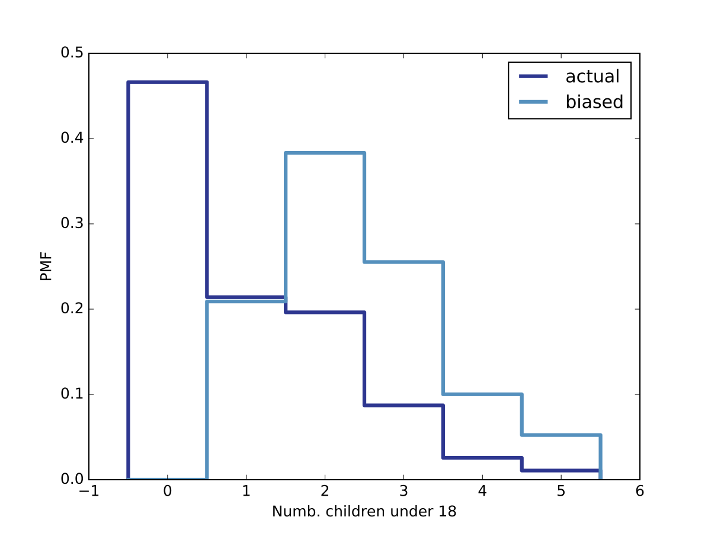

[Think Stats Chapter 3 Exercise 1](http://greenteapress.com/thinkstats2/html/thinkstats2004.html#toc31) (actual vs. biased)

_**Something like the class size paradox appears if you survey children and ask how many children are in their family. Families with many children are more likely to appear in your sample, and families with no children have no chance to be in the sample.
Use the NSFG respondent variable NUMKDHH to construct the actual distribution for the number of children under 18 in the household.
Now compute the biased distribution we would see if we surveyed the children and asked them how many children under 18 (including themselves) are in their household.
Plot the actual and biased distributions, and compute their means. As a starting place, you can use chap03ex.ipynb.**_

**Note: The working directory is `/ThinkStats2/code` and the code is in Python 3**

First we read the dataset
```python
import chap01soln
df = chap01soln.ReadFemResp()
```

Next, we construct the Probability Mass Function (PMF) of the variable `numkdhh`, i.e. the number of children under 18

```python
import thinkstats2
pmf = thinkstats2.Pmf(df.numkdhh)
```

We now compute the **biased distribution**
```python
def BiasPmf(pmf, label=''):
    new_pmf = pmf.Copy(label=label)
    
    for x, p in pmf.Items():
        new_pmf.Mult(x, x)
    
    new_pmf.Normalize()
    return new_pmf

biased = BiasPmf(pmf, label='biased')
```

The following plot shows the actual and biased distributions:



The figure have been generated with this piece of code
```python
import thinkplot
thinkplot.PrePlot(2)
thinkplot.Pmfs([pmf],label="actual")
thinkplot.Pmfs([biased],label="biased")
thinkplot.Save(root="ex3_1_fig1",xlabel="Numb. children under 18",ylabel="PMF")
```

Finally, we compute the means of the two pmfs

```python
print("Mean unbiased=", pmf.Mean())
# Mean unbiased= 1.02420515504
print("Mean biased = ",biased.Mean())
# Mean biased =  2.40367910066
```
