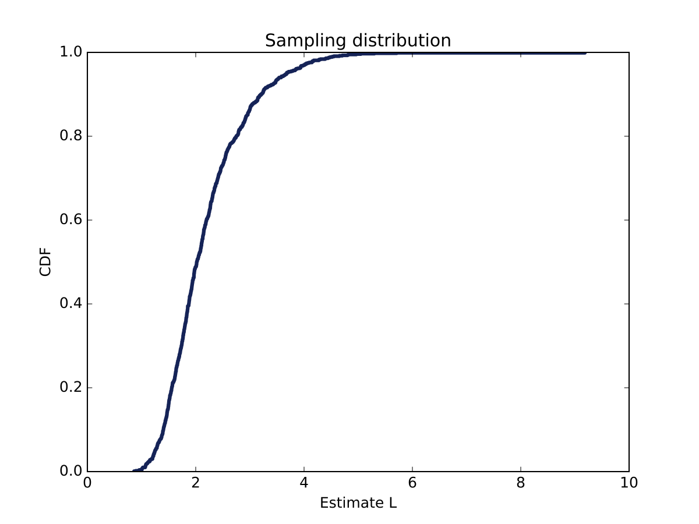
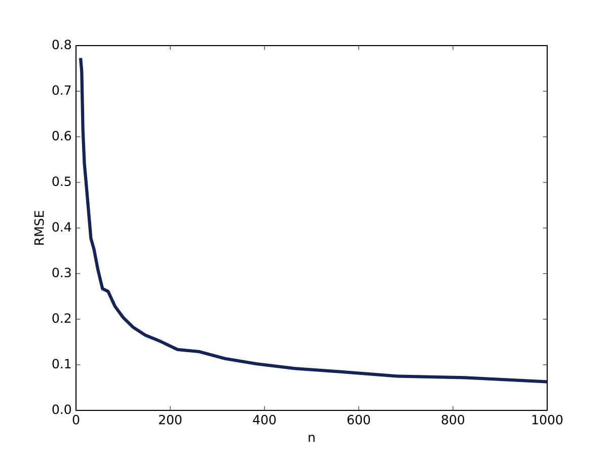

[Think Stats Chapter 8 Exercise 2](http://greenteapress.com/thinkstats2/html/thinkstats2009.html#toc77) (scoring)

_**Suppose you draw a sample with size n=10 from an exponential distribution with λ=2. Simulate this experiment 1000 times and plot the sampling distribution of the estimate L. Compute the standard error of the estimate and the 90% confidence interval.
Repeat the experiment with a few different values of n and make a plot of standard error versus n.**_

**Note: The working directory is /ThinkStats2/code and the code is in Python 3**

We compute the estimate L from 1000 samples of size n=10 drawn from an exponential distribution with λ=2
```python
import numpy as np
from estimation import RMSE
import thinkstats2
import thinkplot

lambda_par = 2
def experiment(n_rnd=10,n_experiments=1000,lambda_par=lambda_par):
    Lambda_est = []
    for _ in range(n_experiments):
        distr = np.random.exponential(scale=1./lambda_par,size=n_rnd)
        Lambda_est.append(1./distr.mean())
    return Lambda_est

Lambda_est = experiment()
```

We then plot the CDF of the estimate L



which has been generated with this piece of code:
```python
cdf = thinkstats2.Cdf(Lambda_est)
thinkplot.Cdf(cdf)
thinkplot.Save(root="ex8_2_fig1",xlabel="Estimate L",ylabel="CDF",title="Sampling distribution")
```

As requested, we compute the standard error and the 90% confidence interval
```python
print("Standard Error = ", RMSE(Lambda_est,lambda_par))
# Standard Error =  0.8251040374160107
print("90 percent confidence interval = ",cdf.Percentile(5),cdf.Percentile(95))
# 90 percent confidence interval =  1.28823799523 3.81288728206
```

Finally, we repated the experiment for 25 values of n

```python
n_range = 10.**np.linspace(1,3,25)
rmse_i=[]
for i in range(len(n_range)):
    Lambda_est_i = experiment(n_rnd=int(n_range[i]))
    rmse_i.append(RMSE(Lambda_est_i,lambda_par))
```

and we plot the standard error versus n



```python
thinkplot.Plot(n_range,rmse_i)
thinkplot.Save(root="ex8_2_fig2",xlabel="n",ylabel="RMSE")
```

We note that as the sample size increases, the standard error decreases.

