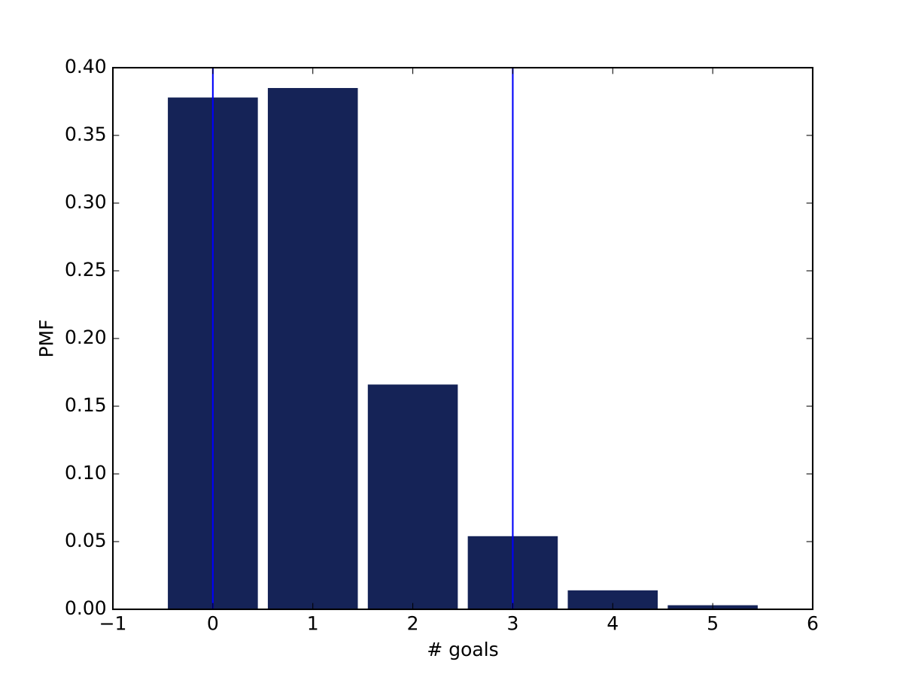

[Think Stats Chapter 8 Exercise 3](http://greenteapress.com/thinkstats2/html/thinkstats2009.html#toc77)


_**In games like hockey and soccer, the time between goals is roughly exponential. So you could estimate a team’s goal-scoring rate by observing the number of goals they score in a game. This estimation process is a little different from sampling the time between goals, so let’s see how it works.
Write a function that takes a goal-scoring rate, lam, in goals per game, and simulates a game by generating the time between goals until the total time exceeds 1 game, then returns the number of goals scored.
Write another function that simulates many games, stores the estimates of lam, then computes their mean error and RMSE.
Is this way of making an estimate biased? Plot the sampling distribution of the estimates and the 90% confidence interval. What is the standard error? What happens to sampling error for increasing values of lam?**_

**Note: The working directory is `/ThinkStats2/code` and the code is in Python 3**

We begin with writing a function that takes as an input the goal-scoring rate `lam` and simulate a game. The time between goals is roughly exponential and the game is over when the total time exceeds 1. The function returns the number of goal scored.

```python
import random

def game(lam):
    # lam are the goals per game
    n_goals = 0
    time = 0
    while(time>=0):
        dt_goals = random.expovariate(lam)
        time += dt_goals
        if(time>1): # if time>1 the game is over
            break
        n_goals+=1
    # the function returns the number of goals scored
    return n_goals
```

Next, we write another function that simulations many games and store the estimate of `lam`

```python
import numpy as np
from estimation import RMSE, MeanError

def many_games(lam=1,ngames=1000,verbose=False):
    lam_estimates=[]
    for _ in range(ngames):
        L = game(lam)
        lam_estimates.append(L)
    
    mean_error = MeanError(lam_estimates,lam)
    rmse = RMSE(lam_estimates,lam)
    
    if(verbose):
        print("Mean error of lam = ",mean_error)
        print("RMSE of lam = ",rmse)
    #
    return mean_error,rmse,lam_estimates

```

The sampling error is small and decreases with increasing `ngames`:

```python
print([many_games(ngames=dummy)[0] for dummy in [10,100,1000,10000]])
# [-0.29999999999999999, 0.059999999999999998, -0.028000000000000001, -0.0115]
```

Therefore, the estimate is unbiased.

Next, we plot the sampling distribution of the estimates and the 90% confidence interval (the two vertical lines)



This figure has been generated with this piece of code

```python
import thinkplot
L = many_games()[2]
pmf = thinkstats2.Pmf(L)
thinkplot.Hist(pmf)
cdf = thinkstats2.Cdf(L)
import matplotlib.pyplot as pyplot
pyplot.axvline(cdf.Percentile(5))
pyplot.axvline(cdf.Percentile(95))
thinkplot.Save(root="ex8_3_fig1",xlabel="# goals",ylabel="PMF")
```

The standard error is given by
```python
print(RMSE(L,1))
0.9664367542679656
```

Finally, we compute the RMSE for increasing values of `lam`
```python
print([many_games(lam=dummy)[1] for dummy in np.arange(1,10,1)])
[0.9777525249264253, 1.3769531582446803, 1.7629520696831211, 1.96596032513375, 2.226656686604381, 2.4365959862069873, 2.7479082954130765, 2.8094483444263574, 2.9115288080319592]
```

and find that the RMSE increases as `lam` increases
